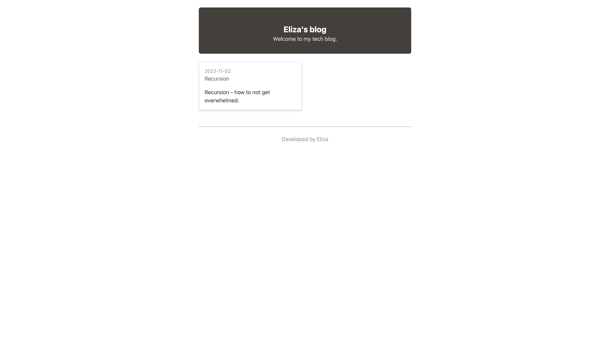

<h1 align="center">
<br>
Blog
<br>
</h1>
<h4 align="center">Made with Next.js</h4>



## Run the App
**Clone the repository**:
```sh
git clone https://github.com/elizanierwinska/Portfolio-site-Three.js.git
```

**Install all the dependencies:** <br>
npm
```sh
npm install 
```
yarn
```sh
yarn install
```
pnpm
```sh
pnpm install
```

**In the project directory run**: <br>
npm
```sh
npm run dev
```
yarn
```sh
yarn run
```
pnpm
```sh
pnpm run
```

This will run the application in the development mode.


## Information about the project

Blog is a blog website built with Next.js, TypeScript, and Tailwind CSS. It allows you to write and publish your own blog posts.
### Features
* **Responsive design**: The website is responsive and optimized for viewing on various devices, ensuring a seamless user experience across desktops, tablets, and smartphones.

## This project was built with:
* Next.js
* TypeScript
* Tailwind.CSS
